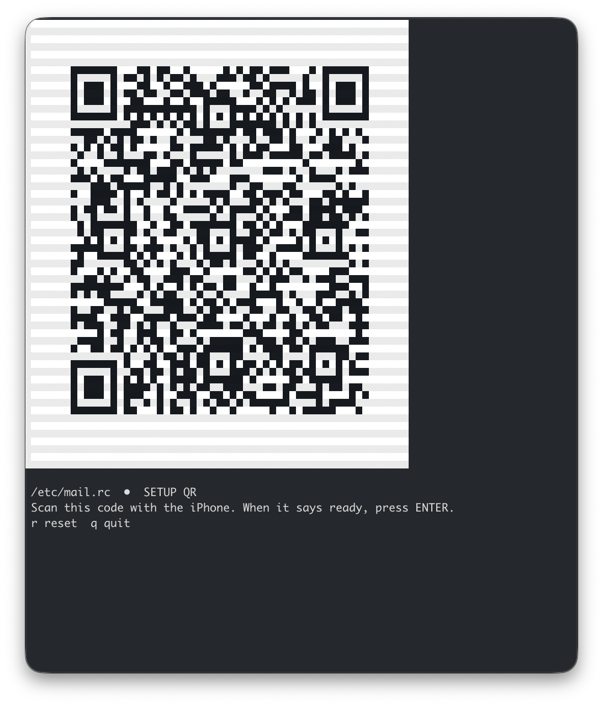

# qrdrop-cli

Terminal QR file sender for QRDrop/QRA1.

It displays a setup QR first, then cycles through data QR frames. The receiver can collect frames in any order, verify chunks, reconstruct the transfer payload, and decompress gzip transfers when applicable.

## Screenshot



## Run

```bash
go run . path/to/file

# or build a reusable binary
go build -o qrdrop-cli .
./qrdrop-cli path/to/file
```

Faster/larger QR codes:

```bash
go run . --chunk-size 300 --fps 5 path/to/file
```

Options:

```text
--chunk-size bytes   raw transfer bytes per QR data frame (default 80)
--fps n              data QR frames per second (default 3)
```

## Controls

| Key | Action |
|---|---|
| Enter | Start the timed data stream after setup succeeds |
| r | Stop and show the setup QR again |
| q / Ctrl-C | Quit |

## Compression

The sender automatically gzip-compresses the whole file when the compressed payload is smaller. Already-compressed formats such as `.zip`, `.tgz`, images, video, and random data usually will not shrink.

## Test

```bash
go test ./...
```

See `PROTOCOL.md` for packet details.
